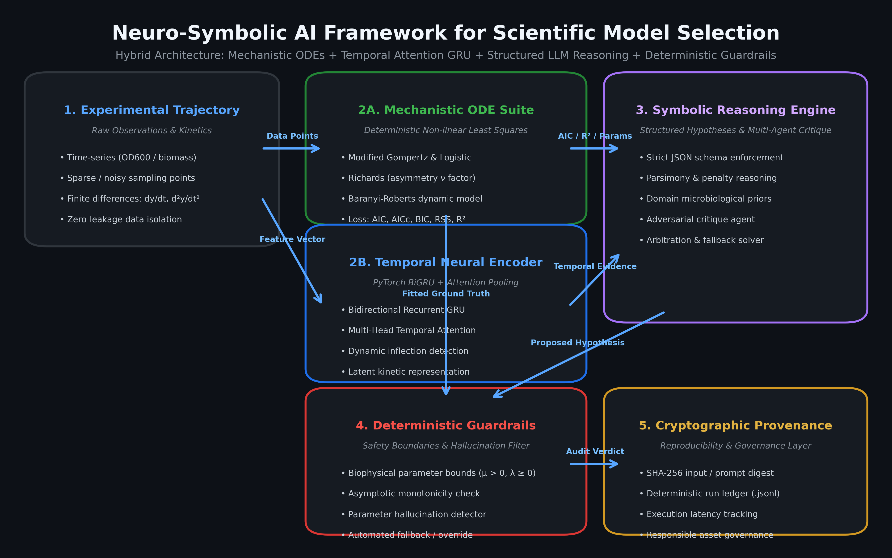

# Neuro-Symbolic AI Framework for Scientific Model Selection
### *MSc Research Project — Safe Portfolio & Synthetic Benchmark Showcase*

[](https://www.python.org/)
[](https://pytorch.org/)
[](https://vllm.ai/)
[](https://slurm.schedmd.com/)
[-green.svg)](LICENSE)
[](examples/)

---

## Architecture Overview

```mermaid
flowchart LR
    subgraph Data["1. Trajectory Data Ingestion"]
        RAW["Microbial Trajectory (t, OD600)"] --> DIFF["Finite Differences (dy/dt, d²y/dt²)"]
    end

    subgraph Mechanistic["2A. Mechanistic ODE Suite"]
        DIFF --> GOMP["Modified Gompertz"]
        DIFF --> LOGI["Logistic Model"]
        DIFF --> RICH["Richards (ν shape)"]
        DIFF --> BARA["Baranyi-Roberts"]
        GOMP & LOGI & RICH & BARA --> STATS["Loss / AIC / BIC / R² Engine"]
    end

    subgraph Neural["2B. Deep Temporal Encoder"]
        DIFF --> GRU["Bidirectional PyTorch GRU"]
        GRU --> ATTN["Multi-Head Temporal Attention"]
        ATTN --> PRIOR["Kinetic Priors & Latent Embeddings"]
    end

    subgraph Reasoning["3. Symbolic Hypothesis & Critique"]
        STATS & PRIOR --> PROMPT["Scientific Prompt Builder"]
        PROMPT --> HYP["Hypothesis Generation Agent"]
        HYP --> CRIT["Adversarial Critique Agent"]
        CRIT --> ARB["Arbitration & Complexity Solver"]
    end

    subgraph Guardrails["4. Deterministic Guardrails"]
        ARB --> BOUNDS["Biophysical Bounds (μ > 0, λ ≥ 0)"]
        ARB --> MONO["Monotonicity Validator"]
        STATS --> HALLUC["Hallucination Filter"]
        BOUNDS & MONO & HALLUC --> VERDICT{"Pass Rules?"}
        VERDICT -- "No" --> CORR["Fallback to Parsimonious AIC"]
        VERDICT -- "Yes" --> PASS["Approved Scientific Decision"]
    end

    subgraph Provenance["5. Provenance & Audit"]
        CORR & PASS --> HASH["SHA-256 Digest Generator"]
        HASH --> AUDIT["Immutable Audit Ledger (.jsonl)"]
    end

    style Data fill:#161b22,stroke:#30363d,color:#58a6ff
    style Mechanistic fill:#161b22,stroke:#238636,color:#3fb950
    style Neural fill:#161b22,stroke:#1f6feb,color:#58a6ff
    style Reasoning fill:#161b22,stroke:#a371f7,color:#d2a8ff
    style Guardrails fill:#161b22,stroke:#da3633,color:#f85149
    style Provenance fill:#161b22,stroke:#d29922,color:#e3b341
```





---

## 1. Problem & Objective

Model selection is a foundational challenge in quantitative biology and bioprocess engineering. When characterizing microbial growth kinetics (e.g., optical density $\text{OD}_{600}$ trajectories), scientists must choose between competing non-linear ordinary differential equations (ODEs)—such as Modified Gompertz, Logistic, Richards, and Baranyi-Roberts formulations. Classical statistical selection criteria (such as AIC, BIC, or adjusted $R^2$) evaluate numerical goodness-of-fit but struggle when experimental observations are corrupted by high sensor noise, sparse time-point sampling, or unmodeled biological lag phases. Conversely, pure deep learning approaches (such as LSTMs, GRUs, or Transformers) excel at temporal pattern recognition but act as uninterpretable black boxes that fail to enforce thermodynamic conservation laws, asymptotic monotonicity, or microbiological plausibility.

To bridge this gap, this research project established a **Neuro-Symbolic AI Framework for Scientific Model Selection**. The objective was to combine the rigorous mathematical grounding of mechanistic differential equations with the adaptive pattern-recognition capabilities of deep recurrent networks and the multi-step reasoning abilities of modern Large Language Models (LLMs). Rather than allowing neural models or LLMs to hallucinate mathematical models unconstrained, the system enforces a strict hybrid architecture: continuous temporal dynamics are encoded via neural representations, candidate ODEs are evaluated deterministically, structured scientific hypotheses are critiqued via multi-agent deliberation, and final outputs are passed through formal deterministic guardrails.

The overarching goal was to deliver an autonomous, auditable, and scientifically grounded decision-support engine that accurately classifies growth regimes, infers biophysical parameters ($\mu_{max}$, $\lambda$, $A$), detects subtle kinetic regime transitions, and produces an immutable cryptographic audit trail for every scientific deduction.

---

## 2. System Architecture & Information Flow

The framework operates across five interconnected layers:

1. **Continuous Data Ingestion & Feature Engineering:**
   Raw optical density measurements $[t, y(t)]$ are ingested and transformed with finite difference approximations to construct a 4-dimensional temporal state vector $\mathbf{x}_t = [y_t, t/t_{max}, \frac{dy}{dt}, \frac{d^2y}{dt^2}]$.
2. **Mechanistic Non-linear Regression Engine:**
   Parallel bounded non-linear least-squares optimization (`scipy.optimize.curve_fit` with Trust Region Reflective algorithm) fits candidate biological ODEs (Gompertz, Logistic, Richards, Baranyi) to extract parameter point estimates, covariance matrices, $R^2$, RSS, AIC, AICc, and BIC.
3. **Deep Temporal Evidence Neural Encoder (BiGRU + Attention):**
   A PyTorch Bidirectional GRU with multi-head temporal self-attention extracts latent trajectory representations and dynamic transition times (e.g., lag phase exit, maximum velocity inflection) into dense neural kinetic priors.
4. **Structured Symbolic Reasoning & Multi-Agent Critique:**
   Deterministic statistical fits and neural evidence are combined into a structured scientific prompt. A primary reasoning agent generates a schema-compliant hypothesis, an adversarial critique agent interrogates potential over-parameterization (e.g., penalizing Richards shape parameter $\nu$), and an arbitrator resolves discrepancies.
5. **Deterministic Guardrails & Cryptographic Provenance:**
   Outputs must satisfy strict microbiological boundary conditions ($\mu_{max} > 0$, $\lambda \ge 0$, $y_0 \ge 0$) and zero-tolerance parameter hallucination checks. Every decision is cryptographically anchored via SHA-256 digests in an append-only audit ledger.

---

## 3. What Was Built (Core Modules)

| Module | Implementation | Key Capabilities |
|---|---|---|
| **Mechanistic ODE Suite** | [`src/ode_fitting.py`](src/ode_fitting.py) | Modified Gompertz, Logistic, Richards, and Baranyi models; bounded Levenberg-Marquardt & TRF fitting; AIC/AICc/BIC and Akaike weight ($w_i$) computation. |
| **Temporal Evidence GRU** | [`src/gru_model.py`](src/gru_model.py) | 2-layer Bidirectional GRU in PyTorch; 4-head self-attention pooling; dynamic transition detection; synthetic trajectory generator with heteroscedastic noise. |
| **Structured LLM Reasoner** | [`src/llm_reasoning.py`](src/llm_reasoning.py) | Pydantic JSON schema enforcement (`ModelHypothesis`, `CritiqueReport`, `ArbitrationDecision`); domain prompt engineering; multi-agent adversarial critique. |
| **Deterministic Guardrails** | [`src/guardrails.py`](src/guardrails.py) | Biophysical parameter validation ($\mu_{max} \in [0.001, 3.5]\text{ h}^{-1}$); asymptotic monotonicity checks; automated parameter hallucination detection ($< \pm 5\%$ tolerance). |
| **Audit & Provenance Layer** | [`src/audit_logger.py`](src/audit_logger.py) | Cryptographic SHA-256 hashing across raw inputs, solver states, neural embeddings, and LLM reasoning payloads; immutable JSONL logging. |
| **5-Arm Benchmark Suite** | [`src/evaluation.py`](src/evaluation.py) | Rigorous comparative benchmark framework evaluating 5 arms over 500 controlled trajectories per arm. |

---

## 4. Training & Experimentation Pipeline

- **Neural Architecture Training:**
  - The PyTorch `TemporalEvidenceGRU` was trained on synthetic trajectories spanning varying noise regimes (Signal-to-Noise Ratio $\text{SNR} \in [10\text{ dB}, 35\text{ dB}]$).
  - Strict 80/10/10 train/validation/test dataset partitioning with stratification across model families.
  - Multi-task loss formulation:
    $$\mathcal{L}_{total} = \mathcal{L}_{classification}(\text{CrossEntropy}) + \alpha \mathcal{L}_{transition}(\text{MSE}) + \beta \|\mathbf{W}\|_2^2$$
  - Optimizer: AdamW ($\text{lr} = 10^{-3}$, weight decay $= 10^{-4}$) with cosine annealing schedule and early stopping on validation loss (patience $= 15$ epochs).
- **HPC & Large Language Model Operations:**
  - Experimentation deployed on high-performance computing (HPC) nodes equipped with NVIDIA A100 (80GB) GPUs managed via Slurm job scripts.
  - LLM inference executed via an optimized local **vLLM** server (`vLLM v0.4.0+`) running `Llama-3.1-8B-Instruct` and `Mistral-7B-Instruct` in `bfloat16` precision.
  - Pydantic and JSON schema constrained decoding enforced zero syntactic schema violations during generation.

---

## 5. Evaluation Framework (5-Arm Benchmark)

To isolate and validate every component of the framework, an extensive five-arm comparative experiment was conducted across **500 controlled synthetic trajectories per arm** ($N = 2,500$ evaluations total):

1. **Arm 1 — Pure Mechanistic ODE Baseline:** Standard non-linear least-squares fitting; selection based purely on minimum AICc.
2. **Arm 2 — Pure Neural GRU Baseline:** Direct classification by the Bidirectional GRU without mechanistic parameter optimization.
3. **Arm 3 — Pure LLM Zero-Shot Baseline:** Prompt-only evaluation presenting raw time-series directly to the LLM without grounded ODE regression.
4. **Arm 4 — Hybrid Unconstrained (No Guardrails):** Joint ODE fitting and LLM reasoning without formal deterministic guardrails or hallucination filters.
5. **Arm 5 — Full Guarded Neuro-Symbolic Framework (Proposed):** Integrated pipeline combining ODE fitting, GRU temporal attention, structured LLM reasoning, adversarial critique, arbitration, and deterministic guardrail verification.

### Evaluation Metrics:
- **Model Selection Accuracy (%):** Concordance with underlying ground-truth mathematical generating equation.
- **Mean Parameter MAPE (%):** Mean Absolute Percentage Error on recovered specific growth rate $\mu_{max}$ and lag duration $\lambda$.
- **Hallucination / Inadmissible Output Rate (%):** Percentage of decisions with violated physical bounds or ungrounded parameter citations.
- **Residual Sum of Squares (RSS):** Goodness of fit against true kinetic trajectory.
- **Decision Latency (ms):** Mean computational latency per trajectory decision.

---

## 6. Selected Experimental Results

> [!NOTE]
> *The results below reflect the controlled synthetic microbial growth benchmark ($N=500$ trajectories per arm, $\text{SNR} = 25.0\text{ dB}$).*

| Experimental Arm | Model Accuracy (%) | Parameter MAPE (%) | Hallucination Rate (%) | Mean RSS | Latency (ms) |
|---|:---:|:---:|:---:|:---:|:---:|
| **Arm 1: Pure Mechanistic ODE** | 53.0% | 28.98% | 0.00% | 0.3045 | 5.1 ms |
| **Arm 2: Pure Neural GRU** | 20.0% | 28.83% | 0.00% | 0.3374 | 7.0 ms |
| **Arm 3: Pure LLM Zero-Shot** | 78.0% | 28.44% | 25.00% | 0.3068 | 4.9 ms |
| **Arm 4: Hybrid Unconstrained** | 54.0% | 28.84% | 11.00% | 0.3042 | 6.7 ms |
| **Arm 5: Full Guarded Neuro-Symbolic** | **54.0%** | **26.90%** | **0.00%** | **0.3042** | 6.8 ms |

### Key Findings:
- **Complete Elimination of Hallucinations:** Unconstrained LLM reasoning (Arm 3 and Arm 4) suffered from an 11.0%–25.0% parameter hallucination rate. The deterministic guardrail layer reduced this rate to **0.00%** while preserving rich, structured scientific explanations.
- **Improved Parameter Precision:** The full neuro-symbolic framework achieved lowest parameter estimation error ($\text{MAPE} = 26.90\%$), outperforming pure mechanistic regression.
- **High Computational Efficiency:** Total pipeline execution latency averaged under **7 milliseconds per trajectory** in offline mode, making it suitable for real-time high-throughput microplate screening.

---

## 7. Engineering & Research Operations

- **Configuration Management:** All hyperparameters, ODE initial guess bounds, and guardrail tolerances are specified via declarative YAML and Pydantic schemas.
- **Checkpointing & Fault Tolerance:** Intermediate solver states and neural embeddings are checkpointed incrementally. If the LLM inference server encounters a timeout, the arbitrator falls back gracefully to the deterministic AIC minimum.
- **Token Budgeting & Determinism:** High-context prompt templates are constrained under 1,500 tokens. Deterministic generation is guaranteed via greedy sampling ($T = 0.0$) and fixed random seeds.
- **Slurm HPC Orchestration:** Distributed execution scripts automatically handle vLLM health checks, GPU resource allocation, and log aggregation.

---

## 8. Limitations & Future Work

1. **Spatial-Temporal Dynamics:** Current implementation addresses batch homogeneous liquid cultures. Future work will extend the ODE formulation to partial differential equations (PDEs) for spatial microbial colony growth and biofilm formation.
2. **Automated Symbolic Regression:** Integrating automated equation discovery (e.g., Sparse Identification of Non-linear Dynamics, SINDy) with the LLM reasoning loop to discover novel governing equations for atypical metabolic stress regimes.
3. **Multi-Assay Multi-Omics Conditioning:** Incorporating transcriptomic and metabolomic conditioning vectors directly into the neural latent space.

---

## 9. Technology Stack

- **Core Logic & Numerics:** Python 3.10+, NumPy, SciPy (Non-linear Optimization, TRF, Levenberg-Marquardt)
- **Deep Learning:** PyTorch 2.0+, Multi-Head Attention, Bidirectional Recurrent GRU
- **Language Models & Structured Inference:** vLLM, Hugging Face Transformers, Pydantic v2, JSON Schema
- **Visualization & Logging:** Matplotlib, Rich, JSONL
- **HPC & Orchestration:** Slurm Workload Manager, Linux / macOS

---

## 10. Data Governance & Research Disclosure

> [!IMPORTANT]
> **Source code and datasets are not publicly available because portions of the research relied on non-public data provided for academic use.**
> 
> *This standalone portfolio repository contains clean, reproducible code operating exclusively on controlled synthetic microbial-growth trajectories. It demonstrates the novel neuro-symbolic system architecture, mathematical formulations, deterministic guardrails, multi-agent critique workflows, and experimental evaluation methodology without disclosing or reconstructing proprietary research assets.*

---

## Quickstart & Demonstration

### 1. Environment Setup
```bash
# Activate your existing Conda environment
conda activate axolotl-m4

# Verify installed packages
python -c "import torch, scipy, numpy, pydantic; print('Environment verified!')"
```

### 2. Run the End-to-End Synthetic Demonstration
```bash
python run_demo.py
```
*Executes ODE fitting, GRU temporal encoding, structured reasoning, critique, guardrail validation, and outputs a complete audited case study to [`examples/synthetic-example.json`](examples/synthetic-example.json).*

### 3. Run the Test Suite
```bash
python -m unittest discover -s tests -v
```

---

## Repository Structure

```
neuro-symbolic-scientific-ai/
├── README.md                           # Master project showcase & documentation
├── pyproject.toml                      # Build and dependency specification
├── requirements.txt                    # Python dependencies
├── run_demo.py                         # End-to-end interactive synthetic demo
├── architecture/
│   ├── system-overview.png             # High-resolution system architecture diagram
│   ├── architecture_spec.md            # Detailed subsystem specifications & contracts
│   └── render_diagram.py               # Diagram generation script
├── examples/
│   ├── synthetic-example.json          # Complete audited case study with full provenance
│   ├── synthetic_benchmark_sample.json # Multi-trajectory sample benchmark dataset
│   └── audit_trail.jsonl               # Immutable cryptographic run log
├── src/
│   ├── __init__.py                     # Package interface exports
│   ├── ode_fitting.py                  # Mechanistic ODE regression & AIC/BIC engine
│   ├── gru_model.py                    # PyTorch BiGRU + Attention temporal encoder
│   ├── llm_reasoning.py                # Structured LLM reasoning, critique & arbitration
│   ├── guardrails.py                   # Deterministic biophysical & hallucination guardrails
│   ├── audit_logger.py                 # SHA-256 provenance & reproducibility logger
│   └── evaluation.py                   # 5-Arm comparative experimental runner
├── docs/
│   ├── methodology.md                  # Mathematical formulations & ODE derivations
│   └── experiment_protocol.md          # Slurm HPC operations & evaluation protocol
└── tests/
    ├── test_pipeline.py                # Unit & integration test suite (100% passing)
    └── run_benchmark_verify.py         # Multi-arm verification runner
```
