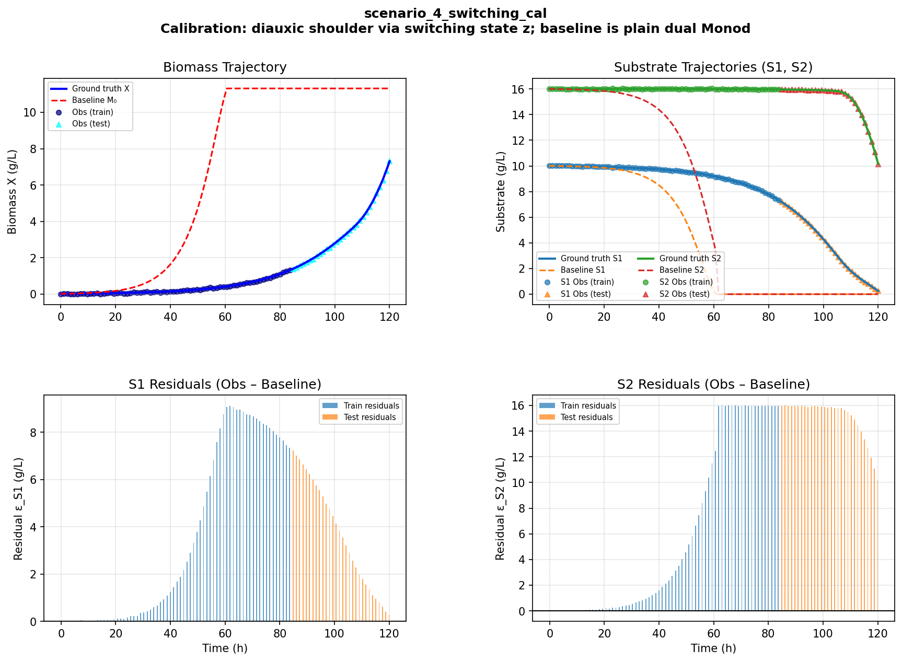
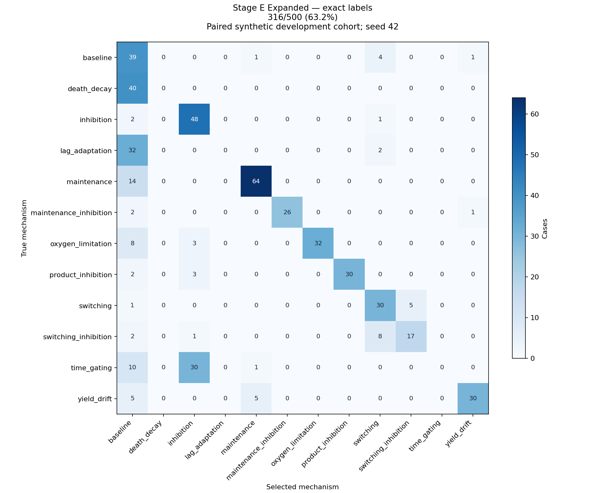
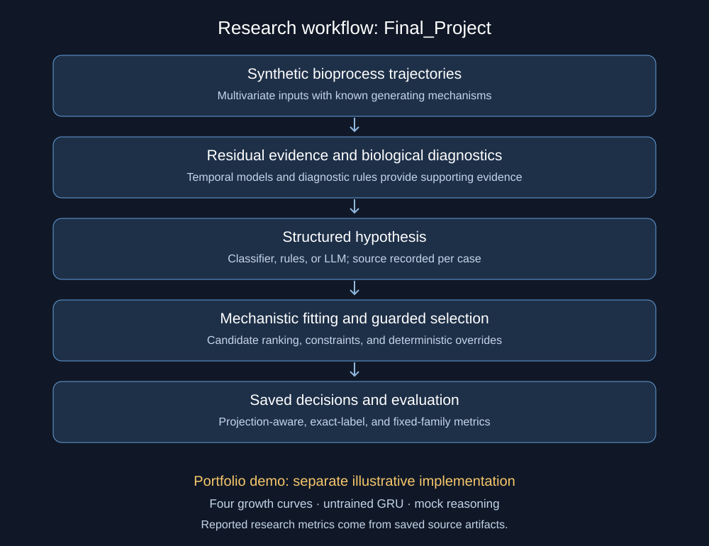

# Neuro-Symbolic Scientific Model Selection

This portfolio reports results extracted from the local `Final_Project` research
artifacts and includes a separate illustrative curve-fitting implementation.
The reported research evaluates synthetic microbial-growth mechanisms; the
implementation in `src/` does not reproduce that research pipeline.

## Interactive research showcase

The [Streamlit frontend](frontend/README.md) adapts the original research
workbench, with saved case diagnostics, hypotheses, fitted candidates, guard
checks, and downloadable reports. It also includes a synthetic-data gallery and
confusion-matrix explorer.

```bash
python -m pip install -r requirements-showcase.txt
python -m streamlit run app.py
```

It runs from bundled synthetic data and frozen result payloads, without an LLM
server or the original project directory. Uploads preview CSV measurements;
research results are replayed from saved files.

### Synthetic data and figures

The repository includes [28 original scenario CSV/PNG pairs](data/README.md),
covering 14 calibration/validation configurations, plus the original frontend's
upload samples. These presentation examples are separate from the frozen
500-case evaluation cohorts.



The [confusion-matrix collection](figures/README.md) includes the original report
PNGs and their underlying CSVs, plus new exact-label and family matrices
recalculated from the frozen Stage E cases.



The original report's projected matrix remains separately labeled as the
provisional **89.8%** result. No experimental Excel file or its data was imported.
All imported file identities are recorded in [the asset manifest](data/showcase_manifest.json).

## Verified research results

The later Stage E development study contains **500 matched cases per arm**.
Counts below were recalculated from the saved per-case result files. Their hashes
match the source project's reporting freeze. The archive identifies job 36212117,
seed 42, and Qwen/Qwen2.5-14B-Instruct; original run-time configuration and commit
snapshots remain unverified.

| Metric | Standard ODE library | Expanded ODE library |
|---|---:|---:|
| Saved projection-aware selection | 419/500 (**83.8%**) | 418/500 (**83.6%**) |
| Exact biological-label selection | 156/500 (**31.2%**) | 316/500 (**63.2%**) |
| Fixed mechanism-family selection | 246/500 (**49.2%**) | 335/500 (**67.0%**) |

The saved projection-aware metric uses different target projections for the two
arms. It is not a common-label accuracy comparison. Exact accuracy compares each
selected mechanism against the same biological truth, treating null truth as
baseline. Fixed-family accuracy applies the same mapping to both arms.

The expanded library improves exact accuracy by **32.0 percentage points** on this
cohort: 166 cases become correct and 6 become incorrect. Family accuracy improves
by **17.8 points**: 105 cases become correct and 16 become incorrect. These changes
measure library coverage as well as selection quality. They do not isolate the
effect of fitting, establish causal mechanism discovery, or demonstrate
performance on real experimental data or untouched seeds.

### Earlier study: provisional provenance

The earlier `report_500/results.json` artifact records **449/500 (89.8%)** under
its saved projection-aware metric and **375/500 (75.0%)** under exact biological
labels. Its hypotheses come from the frozen classifier in 464 cases and the LLM
in 36; all 500 residual sources are `seqmlp`.

A separate local `hpc_gated_override_v1/full_neuro_symbolic/results.json` records
**376/500 (75.2%)** saved correct selections. Its hash differs from the report
artifact. The original HPC source of the 89.8% artifact remains unresolved.
These copies must not be combined, and the earlier result must not be directly
ranked against the later Stage E study.

## Evidence and reproducibility

- [Per-case evidence](results/verified/cases.json): minimal fields extracted from
  four source result sets, including the conflicting earlier local copy.
- [Summary CSV](results/verified/summary.csv) and [summary JSON](results/verified/summary.json):
  recomputed counts, percentages, paired changes, and metric definitions.
- [Source manifest](results/verified/manifest.json): source paths and SHA-256 hashes,
  plus hashes of the derived artifacts.
- [Evidence notes](results/verified/README.md) and [evaluation protocol](docs/experiment_protocol.md):
  interpretation, provenance limits, and verification commands.

Verify the bundled evidence using only the Python standard library:

```bash
python scripts/export_verified_results.py --check
python scripts/verify_showcase_assets.py
python scripts/render_confusion_matrices.py --check
```

Recheck it against the local source files:

```bash
python scripts/export_verified_results.py --check --source-root /Users/harjaschatha/Final_Project
```

This recalculates saved results; it does not rerun training or LLM inference.
Hashes establish artifact identity, not independent confirmation of the original
HPC execution. Source files are read without modification.

## Research architecture



The source research uses multivariate synthetic bioprocess trajectories,
mechanistic fitting, learned temporal evidence, diagnostic rules, structured
hypotheses, and guarded selection. The earlier candidate library includes
baseline additive dual-substrate Monod growth, maintenance, and inhibition.
Later experiments expand directly selectable mechanisms. See the
[architecture notes](architecture/architecture_spec.md).

## Illustrative implementation

The code in `src/` fits Gompertz, Logistic, Richards, and Baranyi curves. Its
default GRU has randomly initialized weights, and its reasoning engine uses
mock deterministic rules. Live LLM generation is not implemented in this demo.
`src/evaluation.py` simulates predictions and parameter drift, including use of
known generating labels in its simulated zero-shot arm. Its outputs are not
research performance measurements.

[Example artifacts](examples/README.md) are historical illustrative outputs.
They are not evidence for the research results above. No trained-GRU performance,
LLM hallucination elimination, parameter-error improvement, or sub-7-ms research
latency is claimed here. JSONL files and hashes provide records and integrity
checks; they do not make files immutable.

To run the optional illustration with the dependencies in `requirements.txt`:

```bash
python run_demo.py
python -m unittest discover -s tests -v
```

The evaluated research data are synthetic. The reported experiments do not
establish generalization to unseen organisms or real laboratory conditions.
