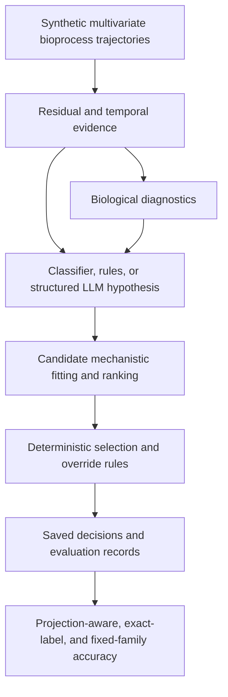

# Architecture and implementation scope

This diagram summarizes the research workflow described by the `Final_Project`
README and reporting freeze. It is not a claim that the local `src/` demo
implements the full research system.

The earlier candidate library uses baseline dual-substrate Monod growth,
maintenance, and inhibition. Stage E expands the selectable mechanisms.
The earlier report uses `seqmlp` residuals in every case and primarily
frozen-classifier hypotheses. Later Stage E results include LLM and
`llm_arbitration` hypothesis sources. Source labels describe stored provenance;
they do not demonstrate that every decision was independently made by an LLM.

The portfolio demonstration instead uses four analytic growth curves, an
untrained GRU, and deterministic mock reasoning. A minimum-information-criterion
fit is a model-selection decision, not ground truth. Guardrail checks have
limited coverage and do not establish a universal absence of hallucinations.
SHA-256 digests support integrity checking; JSONL files remain editable.
