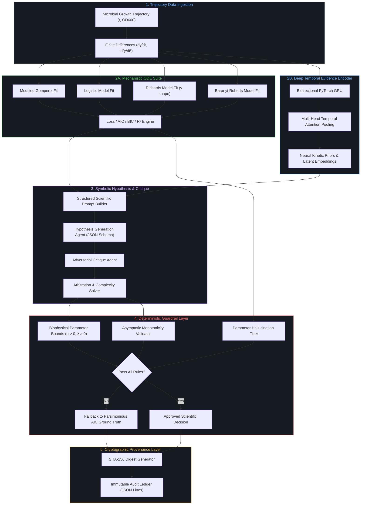

# System Architecture Specification

## Overview

The **Neuro-Symbolic AI Framework for Scientific Model Selection** couples mechanistic differential equations with deep recurrent neural representations and structured large language model (LLM) reasoning, wrapped inside formal deterministic guardrails and cryptographic provenance tracking.

---

## Subsystem Specifications

### 1. Mechanistic ODE Non-linear Regression Engine
- **Supported Formalisms:**
  - **Modified Gompertz:** Asymmetric sigmoidal curve capturing rapid acceleration and exponential deceleration.
  - **Logistic (Verhulst):** Symmetric sigmoidal curve with inflection at mid-point.
  - **Richards:** Generalized 5-parameter curve introducing shape factor $\nu$ for arbitrary inflection points.
  - **Baranyi-Roberts:** Mechanistic kinetic formulation incorporating dynamic physiological adjustment function $A(t)$.
- **Optimization Algorithms:** Bounded Trust Region Reflective (`scipy.optimize.curve_fit(method='trf')`) with empirical parameter initialization from derivative peaks.
- **Statistical Criteria:** Residual Sum of Squares (RSS), $R^2$, Akaike Information Criterion (AIC), Hurvich-Tsai small-sample corrected criterion (AICc), Bayesian Information Criterion (BIC), and Akaike weights ($w_i$).

### 2. Deep Temporal Evidence Encoder (GRU + Attention)
- **Model Topology:** 2-layer Bidirectional Recurrent GRU (PyTorch) with LayerNorm and GELU activations.
- **Input Channels (4D):** $[y(t), t / t_{max}, \frac{dy}{dt}, \frac{d^2y}{dt^2}]$.
- **Multi-Head Self-Attention Pooling:** 4 parallel attention heads projecting temporal hidden vectors to identify critical kinetic transitions (lag exit, maximum specific growth velocity, deceleration).
- **Output Embeddings:** Latent kinetic representation vector ($D=32$) and softmax prior probability distribution over candidate model families.

### 3. Structured LLM Scientific Reasoning Engine
- **Schema Enforcement:** Pydantic models enforcing strict JSON outputs (`ModelHypothesis`, `CritiqueReport`, `ArbitrationDecision`).
- **Prompt Architecture:** Multi-modal prompt syntax binding deterministic numerical fits, information criteria, parameter standard errors, and neural attention transition timings.
- **Multi-Agent Workflow:**
  1. *Primary Reasoner:* Formulates mechanistic hypothesis and biological interpretation.
  2. *Adversarial Critique Agent:* Scrutinizes model complexity over-fitting (e.g., penalizing Richards shape parameter $\nu$ if $\Delta AIC < 2.0$).
  3. *Arbitrator:* Resolves discrepancies between heuristic intuition and empirical evidence.

### 4. Deterministic Guardrails & Hallucination Filter
- **Biophysical Validation:** Hard boundaries on maximum specific growth rate ($\mu_{max} \in [0.001, 3.5]\text{ h}^{-1}$), lag time ($\lambda \in [0, 36]\text{ h}$), and initial optical density ($y_0 \ge 0$).
- **Hallucination Detection:** Compares numerical parameter citations in the LLM output with deterministic solver outputs; flags any deviation exceeding $\pm 5\%$.
- **Automated Fallback:** If any critical rule fails, execution immediately rolls back to the parsimonious minimum-AIC ground-truth model.

### 5. Cryptographic Provenance & Audit Trail
- **Hashing Algorithm:** Canonical JSON serialization hashed via SHA-256.
- **Tracked Entities:** Input trajectory vector, solver parameter dictionary, neural embedding digest, prompt tokens, LLM response payload, and guardrail audit report.
- **Audit Persistence:** Append-only JSONL log guaranteeing byte-level reproducibility for scientific reviews and regulatory compliance.
